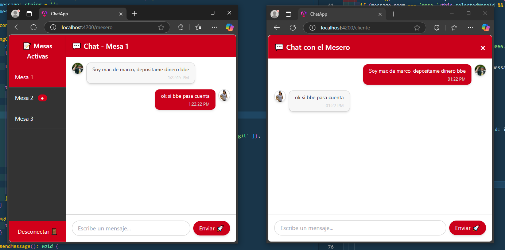

# 💬 Chat en Tiempo Real con Angular y NestJS 🚀



Este proyecto implementa un sistema de **chat en tiempo real** utilizando **Angular** para el frontend y **NestJS** para el backend, con **Socket.IO** para la comunicación en tiempo real.

---

## 📑 **Características Principales**

✅ **Chat Cliente-Mesero:** Comunicación en tiempo real entre clientes y meseros.  
✅ **Soporte Multi-Sala:** Cada mesa tiene su propia sala de chat independiente.  
✅ **Mensajes Persistentes:** Los mensajes se guardan en una base de datos MySQL.  
✅ **Notificaciones Dinámicas:** Indicadores de mensajes no leídos.  
✅ **Interfaz Moderna:** UI inspirada en diseños profesionales, con **TailwindCSS**.  
✅ **Autenticación Simple:** Sistema de autenticación con JWT.

---

## ⚙️ **Tecnologías Utilizadas**

### **Frontend (Angular)**
- Angular 17
- Socket.IO Client
- TailwindCSS
- RxJS

### **Backend (NestJS)**
- NestJS
- Socket.IO
- TypeORM
- MySQL
- Docker

---

## 🛠️ **Instalación y Configuración**

### 🔑 **Requisitos Previos**
- Node.js (v16+)
- Angular CLI (v17+)
- MySQL

---

### 📥 **1. Clonar el Repositorio**

```bash
git clone https://github.com/AlanMelendez/chat-app-angular.git
cd chat-app-angular
